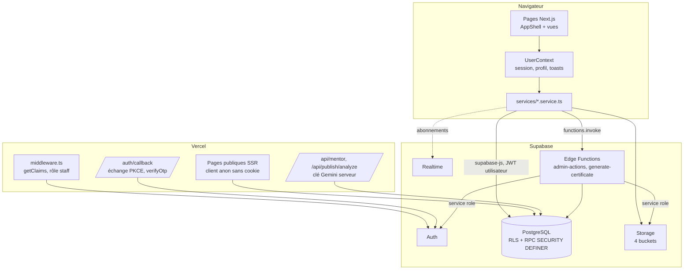
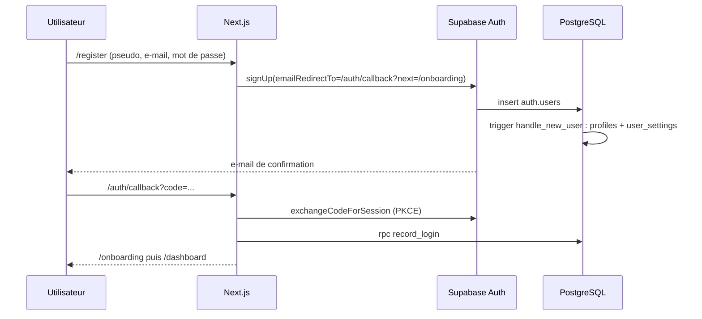

# Architecture

## Vue d'ensemble

## Couches du frontend

| Couche | Emplacement | Responsabilité |
|---|---|---|
| Clients Supabase | `lib/supabase/client.ts`, `server.ts`, `public.ts`, `config.ts` | Client navigateur (cookies via `@supabase/ssr`), client serveur pour les routes, client anon sans cookie pour les pages publiques mises en cache. Tous typés avec `Database`. |
| Services | `services/*.service.ts` | Seul endroit où l'on appelle `from()`, `rpc()`, `storage` ou `functions.invoke`. Chaque fonction renvoie des types de `types/api.ts` et lève une `AppError` traduite. |
| Hooks | `hooks/useAsync.ts`, `hooks/useRealtime.ts` | Chargement asynchrone avec états `loading / error / data` et rechargement ; abonnements Realtime avec nettoyage. |
| Contexte | `context/UserContext.tsx` | Session, profil, paramètres, compteur de notifications, heartbeat de session, actions (`completeLesson`, `submitQuiz`…) qui rafraîchissent le profil et empilent les toasts de récompense. |
| Pages | `app/**` | Les pages apprenant exportent un composant qui enveloppe une vue `XView` dans `<AppShell>` ; la vue utilise `useLearner()` qui garantit un profil chargé. |
| Types | `types/database.types.ts`, `types/api.ts` | Types générés à partir des migrations et formes JSON des RPC. |

Aucun composant React n'importe directement un client Supabase pour lire des données : il passe par un service.

## Où vit la logique métier

La logique sensible (progression, XP, badges, séries, certificats) est écrite en **fonctions PostgreSQL `SECURITY DEFINER`** appelées par RPC, et non dans des Edge Functions. Raisons :

- **Atomicité réelle** : une RPC s'exécute dans une seule transaction. Terminer une leçon enregistre la progression, écrit la transaction d'XP, met à jour la série, les compteurs du jour, les défis, les badges, la complétion du cours et le certificat, ou rien du tout.
- **Pas de clé service role** en circulation pour les opérations courantes : la fonction lit `auth.uid()` et vérifie elle-même les droits.
- **Latence** : un aller-retour vers PostgREST au lieu de deux (fonction puis base).
- **Testable hors ligne** : `tests/database.test.cjs` exécute les migrations dans PGlite et vérifie l'anti-triche.

Les **Edge Functions** sont réservées à ce qui exige la service role ou un runtime JavaScript :

| Fonction | Rôle |
|---|---|
| `admin-actions` | Actions sur `auth.users` : statut, bannissement, débannissement, lien de réinitialisation, suppression. Vérifie `is_admin()` avec le JWT de l'appelant, protège les comptes du staff (superadmin requis) et journalise dans `admin_logs`. |
| `generate-certificate` | Génère le PDF d'un certificat avec pdf-lib, le dépose dans le bucket privé `certificates` et renseigne `pdf_path`. L'apprenant le télécharge par URL signée valable 120 secondes. |

Correspondance avec les fonctions proposées par le cahier des charges :

| Cahier des charges | Implémentation |
|---|---|
| `complete-lesson` | RPC `start_lesson`, `save_lesson_progress`, `complete_lesson` |
| `submit-quiz` | RPC `submit_quiz` |
| `award-xp`, `claim-badge` | Fonctions internes `private.award_xp`, `private.evaluate_badges` (non appelables par le client) |
| `complete-course` | Fonction interne `private.check_course_completion` |
| `generate-certificate` | `private.issue_certificate` (enregistrement) + Edge Function `generate-certificate` (PDF) |
| `send-notification` | Triggers et RPC `admin_broadcast_notification` |
| `admin-actions` | Edge Function `admin-actions` + RPC `admin_*` |

## Authentification

- `/auth/callback` accepte `code` (PKCE) ou `token_hash` + `type` (verifyOtp). Une récupération de mot de passe renvoie vers `/reinitialiser-mot-de-passe`. Un lien expiré renvoie vers `/login?lien=expire`.
- Le **middleware** appelle `getClaims()` à chaque requête : une page privée sans session redirige vers `/login?next=…`, un utilisateur connecté est éloigné des pages d'authentification, et `/admin*` exige un rôle staff lu dans `profiles`.
- La session est persistée dans des cookies gérés par `@supabase/ssr` et rafraîchie par le middleware.
- Ajouter un fournisseur OAuth ne demande que de l'activer dans Supabase et de l'ajouter à `NEXT_PUBLIC_SUPABASE_OAUTH_PROVIDERS`.

## Temps réel

Realtime est utilisé seulement là où il apporte quelque chose :

| Canal | Table | Usage |
|---|---|---|
| `notifications:<uid>` | `notifications` (INSERT, filtré sur l'utilisateur) | Pastille de la cloche et toasts |
| `admin-learner-sessions` | `learner_sessions` | Apprenants en ligne dans la vue d'ensemble admin |
| `admin-activity-events` | `activity_events` (INSERT) | Fil d'activité en direct |

RLS s'applique aussi à Realtime : un apprenant ne reçoit que ses notifications, et seuls les administrateurs voient les sessions et l'activité.

## Gestion des erreurs

Les fonctions SQL lèvent des exceptions avec `hint = 'cyberpingo'` et un message en français. `lib/errors.ts` convertit toute erreur (PostgREST, Auth, Storage, réseau, Edge Function) en `AppError` avec un code (`unauthenticated`, `forbidden`, `not_found`, `invalid`, `conflict`, `rate_limited`, `network`, `not_configured`, `server`) et un message présentable. Un message PostgreSQL brut n'est jamais affiché.

| Code SQLSTATE | Signification |
|---|---|
| `P0002` | Ressource introuvable ou non publiée |
| `42501` | Accès refusé |
| `22023` | Entrée invalide |
| `PT429` | Limite de débit atteinte |

## Pages publiques et cache

Les pages `/`, `/parcours` et `/parcours/[slug]` sont rendues côté serveur avec le client anon sans cookie (`lib/supabase/public.ts`) et revalidées toutes les 5 minutes. `/certificat/[code]` utilise le même client mais est rendue à chaque requête pour refléter immédiatement une révocation. Le client anon ne voit que les cours publiés et les métadonnées des leçons, jamais leur contenu.

## Moteur pédagogique côté interface

| Élément | Emplacement | Rôle |
|---|---|---|
| Mascotte | `lib/mascot/*`, `components/mascot/*` | Un bus d'événements découplé (`emitMascot`, `onMascot`) : `UserContext` traduit les récompenses reçues du serveur (XP, niveau, badge, grade, lab terminé) en événements, `MascotCoach` choisit la réplique active correspondante dans `mascot_lines`. Le texte est toujours affiché (sous-titres activés par défaut), l'audio ne bloque jamais une leçon, une seule voix à la fois, et les préférences (mascotte automatique, voix, volume, sous-titres) sont gardées dans `localStorage` (`cyberpingo.mascot`) et réglables dans `/parametres`. Le coach utilise le Pingo SVG ; un seul canvas WebGL est permis par page. |
| Labs | `components/challenges/*`, `lib/lab-view.ts` | Une interface par format : terminal (`LabTerminal`), PCAP (`PcapViewer` + `lib/pcap.ts`, lecture locale du fichier fourni), journaux (`LogViewer`), Packet Tracer (`PacketTracerGateway` : consignes, fichier à télécharger, formulaire de rendu `LabReportForm`). `LabTasks` gère les étapes et leur correction serveur. Packet Tracer reste un logiciel externe : la plateforme prépare le travail et reçoit le rendu, elle ne prétend jamais l'exécuter dans le navigateur. |
| Compétences et grades | `app/competences`, `components/academy/RankProgress.tsx`, `lib/academy-view.ts` | État de chaque compétence, grade courant, prochain palier avec ce qu'il manque. Les compteurs viennent de `get_my_academy()`. |
| Administration | `components/admin/AdminAcademyPages.tsx`, `AdminCatalogPages.tsx`, `AdminLabParts.tsx`, `AdminCourseEditor.tsx`, `VoiceStudio.tsx` | CMS : domaines, compétences et leurs liens, labs (étapes, ressources, format, brouillon, relecture, publication), badges avec rareté et condition, grades, répliques de la mascotte (avec le studio de voix : enregistrement au micro ou import, envoi dans `mascot-voice`, crédit obligatoire, couverture vocale) et file de relecture des rendus (`/admin/rendus`). Aucune édition de code pour ajouter un cours ou un lab. |
| Accès staff | `lib/admin-access.ts`, `middleware.ts`, `app/admin/layout.tsx`, `lib/navigation.ts` | `canAccessAdminPath` décide de l'accès : `admin` et `superadmin` entrent dans la console, le journal d'audit est réservé au `superadmin`. Les apprenants reçoivent une 404 et ne voient aucun lien d'administration. |
| Images | `components/art/PhotoCover.tsx`, `CourseArt`, `LabArt`, `SceneBanner`, `scripts/generate-images.cjs` | Couvertures de cours et de labs, bannières de section, fond de connexion et image de partage (Open Graph) dans `public/images/`, produites localement par `node scripts/generate-images.cjs [banners\|covers\|scenes\|og]` (sharp, sans service externe, sans texte dans l'image). Chaque composant garde son illustration SVG en repli. |

La navigation reste identique à tous les niveaux : le grade et la mascotte évoluent dans le contenu et les récompenses, pas dans la structure de l'interface.

## Règle : pas de faux backend

Il n'existe aucune donnée simulée. Le seul contenu fourni avec le dépôt est le contenu pédagogique de départ dans `supabase/seed/`, chargé dans la base comme n'importe quel cours créé par un administrateur. Les écrans sans données affichent un état vide explicite. Il en va de même pour les voix, les vidéos et le fichier Packet Tracer : tant que l'équipe ne les a pas fournis, l'interface l'indique honnêtement au lieu de simuler.
