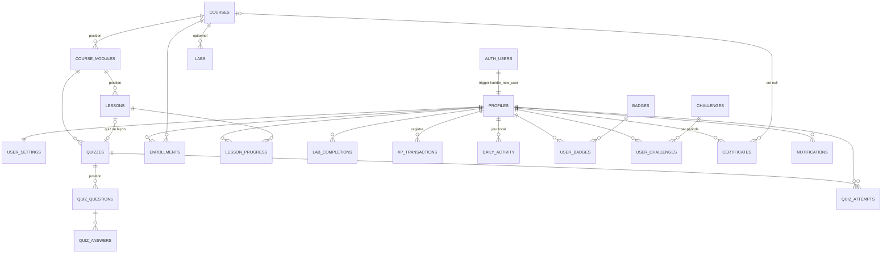

# Base de données

Le schéma complet est défini par les migrations de `supabase/migrations/`. Elles reconstruisent la base de zéro (`supabase db reset`) et sont la seule source de vérité : aucune table n'est créée à la main.

## Migrations

| Fichier | Contenu |
|---|---|
| `20260928190000_foundation.sql` | Schéma `private`, limites de débit, `profiles`, `user_settings`, rôles (`is_admin`, `is_superadmin`), `admin_logs`, activité et sessions, messages de contact, quota du mentor, RPC de compte |
| `20260928190100_learning_content.sql` | `courses`, `course_modules`, `lessons`, `quizzes`, `quiz_questions`, `quiz_answers`, `labs`, `private.lab_flags`, droits par colonne, contrôles de publication |
| `20260928190200_gamification.sql` | `levels`, `notifications`, `xp_transactions` (registre), `badges`, `user_badges`, `daily_activity`, `challenges`, `user_challenges`, `certificates` |
| `20260928190300_progress_engine.sql` | `enrollments`, `lesson_progress`, `quiz_attempts`, `lab_completions`, vue `course_progress`, moteur de progression et RPC apprenant |
| `20260928190400_admin.sql` | RPC d'administration, import de cours, statistiques, révocation de certificats, annonces, publication Realtime |
| `20260928190500_storage.sql` | Buckets et politiques Storage |
| `20261002000000_academy_engine.sql` | Moteur pédagogique : domaines, compétences, labs structurés (étapes, ressources, rendus), grades, répliques de la mascotte, badges à condition vérifiable. Additive, sans suppression de données |
| `20261002010000_staff_roles_voice.sql` | Journal d'audit réservé au superadmin (politique `Superadmins read the audit log` sur `admin_logs`), bucket `mascot-voice` et ses quatre politiques staff |

Les données de référence indispensables (20 niveaux, 10 badges, 4 défis, 9 grades) sont insérées par les migrations. Le contenu pédagogique de départ est dans `supabase/seed/01_starter_content.sql`, puis `supabase/seed/02_reseaux_path.sql` pour les premières leçons et laboratoires Réseaux, `supabase/seed/03_soc_path.sql` pour le parcours Linux et investigation SOC, `supabase/seed/04_mascot_voices.sql` pour les voix de Pingo, `supabase/seed/05_reseaux_programme.sql` pour le programme Réseaux complet, `supabase/seed/06_fondamentaux_programme.sql` pour le programme Fondamentaux complet, `supabase/seed/07_lab_documents_pdf.sql` pour la version PDF des documents de laboratoire, `supabase/seed/08_linux_programme.sql` pour le programme Administration Linux complet `supabase/seed/09_logs_programme.sql` pour le programme Analyse de logs complet et `supabase/seed/10_securite_web_programme.sql` pour le programme Sécurité Web complet (voir `docs/CONTENU.md`).

## Relations



Toutes les tables liées à un utilisateur référencent `profiles(id)` avec `on delete cascade` : supprimer un compte supprime ses données. Les certificats gardent un instantané du titre du cours (`course_title`) et restent valides si le cours est supprimé (`on delete set null`).

## Tables principales

### Comptes

| Table | Points clés |
|---|---|
| `profiles` | Lié à `auth.users`. `email` (copie synchronisée par trigger depuis `auth.users`), `username` unique (`^[a-z0-9_]{3,32}$`), `display_name`, `avatar_path` (`<uid>/<fichier>`), `bio` (280 max), `role` (`user`, `admin`, `superadmin`), objectifs d'onboarding, `daily_minutes`. `xp`, `level`, `current_streak`, `longest_streak`, `last_activity_date` sont en lecture seule pour le client. Aucun mot de passe. |
| `user_settings` | `timezone` (validé contre `pg_timezone_names`, défaut `Europe/Paris`) et préférences de notifications. |
| `admin_logs` | Journal d'audit : auteur, action, cible, détails JSON. Alimenté par triggers et par les RPC/fonctions d'administration. |
| `activity_events`, `learner_sessions` | Fil d'activité et présence en ligne pour la console d'administration. |
| `contact_messages` | Messages du formulaire de contact (lecture réservée au staff). |

### Contenu

| Table | Points clés |
|---|---|
| `courses` | `slug` unique, `status` (`draft`, `published`, `archived`), `access_level` (`free`, `premium`, `private`), `level`, `category`, `estimated_duration`, `completion_xp` (100), `certificate_enabled`, `published_at`. La publication est refusée (`assert_course_publishable`) si le cours n'a aucun module, si un module n'a aucune leçon, si une leçon est vide ou si un quiz est incomplet. |
| `course_modules` | Ordonnés par `position`. |
| `lessons` | `course_id` déduit du module par trigger. `content_type` (`article`, `video`, `exercise`, `mixed`) et `content` JSONB `{ "blocks": [...] }` avec des blocs `text`, `heading`, `code`, `example`, `callout`, `schema`, `video`, `image`, `resource`, validés par trigger (80 blocs et 256 Ko maximum, URL en `https://`). `duration_minutes`, `xp_reward` (50). |
| `quizzes` | Rattachés à un module, et éventuellement à une leçon (un quiz maximum par leçon). `pass_percentage` (70). |
| `quiz_questions` | `single_choice`, `multiple_choice`, `true_false`, `explanation`, `difficulty`, `xp_reward` (10). |
| `quiz_answers` | La colonne `is_correct` n'est pas accessible aux apprenants. |
| `labs` et `private.lab_flags` | Exercices pratiques. Le drapeau attendu est stocké dans le schéma `private`, jamais exposé. |

### Progression et gamification

| Table | Points clés |
|---|---|
| `enrollments` | Unique par (utilisateur, cours). `status` `active` ou `completed`, dernière leçon ouverte. Prête pour les cours premium, privés ou par cohorte. |
| `lesson_progress` | Clé (utilisateur, leçon). `status` (`not_started`, `in_progress`, `completed`), `progress_percentage`, `started_at`, `completed_at`, `xp_awarded`. |
| `quiz_attempts` | Chaque tentative corrigée : score, pourcentage, réussite, XP attribuée. |
| `lab_completions` | Un lab résolu par utilisateur. |
| `course_progress` (vue) | Progression par cours calculée à la lecture (`security_invoker`, donc soumise au RLS). |
| `xp_transactions` | Registre d'XP : `amount`, `reason`, `reference_type`, `reference_id`, `label`. |
| `levels` | `level`, `required_xp`, `title`. |
| `daily_activity` | Compteurs par jour local : leçons, quiz, labs, XP, minutes d'étude. |
| `badges` / `user_badges` | Critères déclaratifs, attribution par le serveur. |
| `challenges` / `user_challenges` | Défis quotidiens, hebdomadaires ou uniques ; progression par période. |
| `certificates` | `certificate_number` (`CP-AAAA-000001`), `verification_code` (16 caractères), `recipient_name`, `course_title`, `revoked_at`, `pdf_path`. |
| `notifications` | Types `achievement`, `course`, `challenge`, `system`, `certificate`, `streak`, `level`. `link` doit être un chemin relatif. |

## XP et niveaux

`profiles.xp` n'est jamais modifié directement. Toute XP passe par `private.award_xp`, qui insère une ligne dans `xp_transactions`. Le trigger `apply_xp_ledger` met alors à jour `profiles.xp` et recalcule `profiles.level`, ce qui rend impossible toute incohérence entre XP et niveau.

- Motifs : `lesson_completed`, `quiz_completed`, `lab_completed`, `challenge_completed`, `course_completed`, `achievement`, `daily_goal`, `admin_adjustment`.
- L'index unique partiel `xp_transactions_once (user_id, reason, reference_id)` garantit qu'une leçon, un lab, un cours, un badge, un défi ou un objectif quotidien ne rapporte qu'une fois. Les quiz en sont exclus : une meilleure note rapporte seulement la différence avec la meilleure note précédente.
- Seul `admin_adjustment` accepte un montant négatif.
- Niveau `n` : `required_xp = 50 × n × (n - 1)`, soit 0, 100, 300, 600, 1000… jusqu'au niveau 20 (19 000 XP). Titres de « Recrue » à « Grand maître ». Un passage de niveau crée une notification.

## Série quotidienne

`private.record_activity` est appelée par chaque activité éligible (leçon terminée, quiz réussi, lab résolu). Le jour est calculé dans le fuseau de l'utilisateur (`user_settings.timezone`) :

- même jour que `last_activity_date` : rien ne change ;
- veille : `current_streak + 1` ;
- autre jour : la série repart à 1.

`longest_streak` garde le record. Des notifications sont créées à 3, 7, 14, 30, 50, 100, 200 et 365 jours. L'affichage utilise `private.effective_streak`, qui renvoie 0 si la dernière activité date d'avant-hier ou plus.

## Moteur de progression

| RPC | Effet |
|---|---|
| `enroll_in_course(course)` | Inscription. Automatique pour un cours publié gratuit ; un cours `premium` ou `private` exige une inscription existante (créée par un futur flux de paiement ou par un administrateur). |
| `start_lesson(lesson)` | Ouvre la leçon (et inscrit au cours si besoin), crée `lesson_progress` en `in_progress`, renvoie l'état et le temps minimal de 15 secondes. |
| `save_lesson_progress(lesson, pct)` | Sauvegarde le pourcentage de lecture. |
| `complete_lesson(lesson)` | Vérifie l'accès, l'ouverture préalable et le temps minimal, puis dans la même transaction : progression, XP, activité du jour, série, objectif quotidien, défis, badges, complétion du cours, certificat. Renvoie un résumé des récompenses. |
| `submit_quiz(quiz, answers)` | Correction serveur, tentative enregistrée, XP d'amélioration, puis la même chaîne de récompenses. Révèle les bonnes réponses et explications après correction. |
| `submit_lab(lab, answer)` | Compare au drapeau privé, avec budget de tentatives. |
| `get_my_dashboard()`, `get_my_stats()` | Agrégats calculés en SQL pour le tableau de bord et la page Progression. |
| `verify_certificate(code)` | Vérification publique d'un certificat (accessible à `anon`). |
| `mark_all_notifications_read()`, `reset_my_progress()`, `delete_my_account()` | Actions sur son propre compte. |

`private.course_mode` décide si l'appelant est `learner` (progression enregistrée) ou en `preview` (administrateur sur un contenu non publié, sans récompense). Un apprenant inscrit à un cours archivé garde l'accès et peut le terminer.

Fin de parcours : quand toutes les leçons sont terminées et tous les quiz réussis, `check_course_completion` passe l'inscription en `completed`, attribue `completion_xp`, notifie et, si `certificate_enabled`, appelle `issue_certificate`.

## Administration

`admin_overview`, `admin_users`, `admin_user_detail`, `admin_set_role` (superadmin, jamais sur soi-même), `admin_adjust_xp`, `admin_get_quiz`, `admin_save_quiz`, `admin_get_lab_flag`, `admin_set_lab_flag`, `admin_import_course` (crée toujours un brouillon), `admin_course_stats`, `admin_revoke_certificate`, `admin_restore_certificate`, `admin_broadcast_notification`. Chaque fonction commence par `private.require_admin()` ou `private.require_superadmin()`.

Les modifications de cours, modules, leçons, quiz, labs, badges et défis par le staff passent directement par PostgREST, protégées par des politiques `(select public.is_admin())`, et sont journalisées par triggers.

## Moteur pédagogique

La migration `20261002000000_academy_engine.sql` ajoute la chaîne apprentissage, entraînement, correction, mise en situation et validation. Tout est modifiable depuis `/admin` : aucune nouvelle leçon, étape de lab ou réplique n'exige de toucher au code.

| Objet | Rôle |
|---|---|
| `domains`, `courses.domain_id` | Domaines de cybersécurité (6 créés : fondamentaux, réseaux, Linux, sécurité web, pentest, détection). Un cours se rattache à un domaine. |
| `skills`, `skill_links` | Compétences, reliées à des leçons (`lesson`), des quiz (`quiz`), des labs d'entraînement (`practice`) et des labs d'évaluation (`validation`). Un lien `validation` ne peut viser qu'un lab `is_assessment`. |
| `user_skills` | État calculé par le serveur : `learning`, `consolidating`, `exercises_mastered`, `validated`. Jamais écrit par le client. |
| `labs` (colonnes ajoutées) | `format` (`terminal`, `pcap`, `logs`, `packet_tracer`), `briefing`, `constraints`, `tools`, `requires_computer`, `is_assessment`, `estimated_minutes`, `course_id`. Statut `review` ajouté aux cours et aux labs. |
| `lab_tasks`, `private.lab_task_keys` | Étapes d'un lab (30 au plus). Les réponses attendues vivent dans le schéma `private` et ne sont jamais lisibles par le client. |
| `lab_task_completions` | Étapes réussies par apprenant. |
| `lab_assets` | Fichiers fournis (journaux, PCAP, `.pkt`, consignes, topologies, modèles de rapport). Les fichiers du dépôt sont dans `public/labs/`. |
| `lab_submissions` | Rendu d'un lab Packet Tracer : note, lien HTTPS facultatif, statut `pending`, `approved` ou `changes_requested`, retour du relecteur. Une soumission par apprenant et par lab. |
| `ranks`, `user_ranks` | Grades pédagogiques. Les critères sont un objet validé par trigger (`min_level`, `lessons_completed`, `labs_solved`, `courses_completed`, `skills_mastered`, `skills_validated`). |
| `mascot_lines` | Répliques de la mascotte rattachées à un événement et à une expression. Le texte est obligatoire ; un fichier audio exige un crédit de voix. |
| `badges` (colonnes ajoutées) | `criteria_lab_id`, `criteria_skill_id` et `rarity` (`common`, `rare`, `epic`, `legendary`). |

RPC apprenant : `get_my_academy()` (domaines, compétences, grade et prochain grade), `submit_lab_task(task, answer)` (correction serveur, comparaison normalisée par `private.norm_answer`, 10 erreurs maximum en 10 minutes par étape) et `submit_lab_report(lab, note, link)` (rendu pour un lab Packet Tracer).

RPC staff : `admin_get_lab_tasks`, `admin_set_lab_tasks` (remplace les étapes d'un lab) et `admin_review_submission(id, status, feedback)` (`approved` ou `changes_requested` ; les corrections exigent un retour ; l'apprenant est notifié et l'action est journalisée).

Les fonctions `private.finish_lab`, `private.sync_skills`, `private.evaluate_rank`, `private.evaluate_badges` et `private.after_progress` sont appelées dans la même transaction que la leçon, le quiz ou le lab qui les déclenche : XP, compétence, grade et badge sont donc cohérents.

Un lab ne peut être publié que s'il a un drapeau ou au moins une étape. `reset_my_progress` efface aussi les étapes, rendus, compétences et grades de l'apprenant.

Le contenu du parcours Réseaux (cours `reseaux`) est dans `supabase/seed/content/reseaux-path.ts`, converti par `node scripts/generate-reseaux-seed.cjs` en `supabase/seed/02_reseaux_path.sql` (à charger après `01_starter_content.sql`, idempotent) : 24 leçons, 43 questions de quiz, 10 labs (dont `reseau-instable` en PCAP, `incident-pare-feu` en journaux, `packet-tracer-sous-reseaux` et `evaluation-reseaux`), 8 ressources, 6 compétences, 22 répliques de mascotte. Les fichiers de `public/labs/` sont produits par `scripts/generate-lab-assets.cjs`. Le badge existant `expert-reseau` exige désormais aussi les nouvelles leçons et les nouveaux quiz du parcours.

Le parcours Linux et investigation SOC (cours `linux` et `analyse-logs`) est dans `supabase/seed/content/soc-path.ts`, converti par `node scripts/generate-soc-seed.cjs` en `supabase/seed/03_soc_path.sql` (à charger après le 02, idempotent) : 2 modules, 5 leçons, 5 quiz, 4 labs au format journaux (`audit-linux-droits`, `brute-force-ssh`, `intrusion-web`, `investigation-soc` qui sert d'évaluation), 36 étapes vérifiées, 9 ressources, 5 compétences, 5 badges (dont deux épiques) et 8 répliques de mascotte. Les 02 et 03 partagent le constructeur `scripts/seed-path-builder.cjs`. Les journaux de `public/labs/` sont générés par `scripts/generate-lab-assets.cjs` à partir de `scripts/lab-scenarios-soc.cjs`, et les clés de correction des étapes viennent des mêmes faits (`facts.soc`), jamais écrites à la main. Chaque lab a son propre attaquant (adresse IP distincte), pour qu'une réponse ne serve pas à un autre lab.

Le programme Réseaux complet (cours `reseaux`) est dans `supabase/seed/content/reseaux-programme.ts` et les quatre parties de leçons `reseaux-programme-a.ts` à `-d.ts`, converti par `node scripts/generate-reseaux-programme-seed.cjs` en `supabase/seed/05_reseaux_programme.sql` (à charger après le 04, idempotent). Il ajoute 21 leçons, 24 quiz, 5 laboratoires (`tp-reseau-domestique`, `tp-vlan-pme`, `tp-multi-sites`, `incident-reseau-kora` et `projet-reseau-kora`, ces deux derniers étant des évaluations), 63 étapes vérifiées, 10 compétences et 6 badges, et il porte le cours à 10 modules et 31 leçons. Il réorganise aussi le cours déjà publié sans rien supprimer : les six modules existants sont renommés et repositionnés (seulement tant qu'ils portent encore leur titre d'origine), dix leçons sont placées dans le bon module, trois leçons de départ (`l1`, `l2`, `l-c2-3`) sont remplacées par leur version complète seulement si leur contenu est encore celui de départ, et sept leçons reçoivent leurs références. Les identifiants ne changent jamais : la progression, les tentatives de quiz et les compétences des apprenants sont conservées, et une modification faite par un administrateur dans la console n'est jamais écrasée. La durée affichée du cours devient la somme de ses leçons. Les fichiers de laboratoire viennent de `scripts/lab-scenarios-reseaux.cjs` et `scripts/lab-scenarios-kora.cjs` (calculs dans `scripts/lab-network-kit.cjs`), et les clés de correction de `facts.programme`.

Le programme Fondamentaux complet (cours `fondamentaux`) est dans `supabase/seed/content/fondamentaux-programme.ts`, les quatre parties de leçons `fondamentaux-programme-a.ts` à `-d.ts` et les deux fichiers de laboratoires `fondamentaux-labs-a.ts` et `fondamentaux-labs-b.ts`, converti par `node scripts/generate-fondamentaux-seed.cjs` en `supabase/seed/06_fondamentaux_programme.sql` (à charger après le 05, idempotent). Il ajoute 21 leçons, 23 quiz, 7 laboratoires au format journaux (`tp-analyse-phishing`, `tp-audit-mots-de-passe`, `tp-hygiene-postes`, `tp-integrite-chiffrement`, `tp-registre-risques`, `incident-compte-compromis` et `projet-audit-soleil`, ces deux derniers étant des évaluations), 88 étapes vérifiées, 8 compétences et 6 badges, et il porte le cours à 8 modules et 24 leçons. Comme pour le Réseaux, la réorganisation du cours déjà publié ne supprime rien : les deux modules existants sont renommés (seulement tant qu'ils portent leur titre d'origine), trois leçons de départ (`l-c1-1`, `l-c1-2`, `l-c1-3`) sont remplacées par leur version complète seulement si leur contenu est encore celui de départ, et le quiz de départ de `l-c1-3` est complété (ses deux explications trop courtes sont remplacées tant qu'elles portent le texte de départ, deux questions sont ajoutées après les existantes) sans toucher aux tentatives des apprenants. Les fichiers de laboratoire viennent de `scripts/lab-scenarios-securite-a.cjs` et `scripts/lab-scenarios-securite-b.cjs`, et les clés de correction de `facts.fondamentaux` ; `tests/fondamentaux-guides.test.cjs` vérifie qu'aucun guide ne contient une réponse et, sous Windows, exécute réellement les blocs PowerShell et bash de chaque guide sur les fichiers générés.

Le programme Administration Linux complet (cours `linux`, identifiant `c3`) est dans `supabase/seed/content/linux-programme.ts` (assemblage, compétences, badges, textes du cours), les quatre parties de leçons `linux-programme-a.ts` à `-d.ts` et les trois fichiers de laboratoires `linux-labs-a.ts`, `-b.ts` et `-c.ts`, converti par `node scripts/generate-linux-seed.cjs` en `supabase/seed/08_linux_programme.sql` (à charger après le 07, idempotent). Il ajoute 25 leçons, 26 quiz, 8 laboratoires au format journaux (`tp-linux-arborescence`, `tp-linux-comptes-droits`, `tp-linux-processus-services`, `tp-linux-reseau-ssh`, `tp-linux-maj-sauvegardes`, `tp-linux-scripts`, `incident-serveur-linux` et `projet-audit-linux`, ces deux derniers étant des évaluations), 126 étapes vérifiées, 61 fichiers de laboratoire, 8 compétences et 7 badges, et il porte le cours à 9 modules et 29 leçons. Comme pour les autres parcours, la réorganisation du cours déjà publié ne supprime rien : les trois modules existants sont renommés (seulement tant qu'ils portent leur titre d'origine), les leçons de départ `l-c3-1` et `l-c3-2` sont remplacées ou complétées seulement si leur contenu est encore celui de départ, les deux leçons publiées `linux-journaux` et `linux-audit-droits` gardent leur place et reçoivent leurs références, et le laboratoire `audit-linux-droits` reste le premier du cours. Les fichiers de laboratoire viennent de `scripts/lab-scenarios-linux-a.cjs`, `-b.cjs` et `-c.cjs`, et les clés de correction de `facts.linux`. Les guides, grilles et modèles du programme sont publiés directement en PDF par ce seed (documents marqués `direct` dans `scripts/pdf/documents.cjs`, ignorés par le 07). `tests/linux-guides.test.cjs` vérifie qu'aucun guide ne contient une réponse, que les commandes de chaque guide (Git Bash et PowerShell 5.1) travaillent sur des données inventées créées dans le bloc et qu'aucune n'affiche une réponse du labo ; `tests/linux-labs-a.test.cjs`, `-b.test.cjs` et `-c.test.cjs` recalculent chaque réponse depuis les fichiers, indépendamment du générateur.

Le programme Analyse de logs complet (cours `analyse-logs`, identifiant `c6`) suit le même modèle : `supabase/seed/content/logs-programme.ts` (assemblage, compétences, badges, textes du cours), les cinq parties de leçons `logs-programme-a.ts` à `-e.ts` et les trois fichiers de laboratoires `logs-labs-a.ts`, `-b.ts` et `-c.ts`, convertis par `node scripts/generate-logs-seed.cjs` en `supabase/seed/09_logs_programme.sql` (à charger après le 08, idempotent). Il ajoute 26 leçons, 26 quiz, 6 laboratoires au format journaux (`tp-logs-formats-temps`, `tp-logs-windows`, `tp-logs-reseau`, `tp-logs-correlation`, `tp-logs-detection` et `projet-soc-pme`, ce dernier étant une évaluation), 94 étapes vérifiées, 34 fichiers de laboratoire, 8 compétences et 7 badges, et il porte le cours à 10 modules et 32 leçons. La réorganisation du cours déjà publié ne supprime rien : les trois modules existants sont renommés (seulement tant qu'ils portent leur titre d'origine), les trois leçons de départ `logs-lire`, `logs-correler` et `logs-triage` sont remplacées et leur quiz complété seulement si leur contenu est encore celui de départ, les trois leçons détaillées `soc-ssh-bruteforce`, `soc-web-logs` et `soc-chronologie` gardent leur place et reçoivent leurs références, et les laboratoires `brute-force-ssh`, `intrusion-web` et `investigation-soc` restent les premiers du cours (`investigation-soc` sert de pratique à la compétence `rapport-investigation`). Les fichiers de laboratoire viennent de `scripts/lab-scenarios-logs-a.cjs`, `-b.cjs` et `-c.cjs`, et les clés de correction de `facts.logs`. Les guides, grilles et modèles du programme (préfixe `slg-`) sont publiés directement en PDF par ce seed. `tests/logs-guides.test.cjs` et `tests/logs-labs-a.test.cjs`, `-b.test.cjs` et `-c.test.cjs` appliquent les mêmes contrôles que pour le Linux, et `tests/logs.test.cjs` rejoue la migration, l'ordre du cours et le parcours complet d'un apprenant.

## Storage

| Bucket | Accès | Taille max | Types | Écriture |
|---|---|---|---|---|
| `avatars` | public | 2 Mo | PNG, JPEG, WebP | propriétaire, dans `<uid>/` |
| `course-images` | public | 5 Mo | images (SVG inclus) | staff |
| `lesson-assets` | public | 20 Mo | images, PDF, MP4 | staff |
| `certificates` | privé | 5 Mo | PDF | service role uniquement ; lecture par le propriétaire et le staff |
| `mascot-voice` | public | 5 Mo | WebM, Ogg, MP3, MP4, WAV | staff (liste, envoi, remplacement, suppression) |

Les voix de Pingo sont soit des enregistrements humains, soit une voix de synthèse déclarée comme telle (le crédit commence alors par « Voix de synthèse »). Les 30 répliques de départ utilisent la synthèse et sont attachées par supabase/seed/04_mascot_voices.sql ; chacune se remplace depuis le studio. `mascot_lines.audio_url` n'accepte qu'une URL `https://` ou un chemin `/audio/...`, et exige un `voice_credit` (1 à 120 caractères). Le studio d'administration (`/admin/mascotte`) enregistre au micro ou importe un fichier, l'envoie dans `mascot-voice` et renseigne la réplique.

## Types TypeScript

`npm run db:types` exécute les migrations dans PGlite (PostgreSQL en WebAssembly, sans Docker) et régénère `types/database.types.ts`. Avec un projet lié, l'alternative officielle est :

```bash
npx supabase gen types typescript --linked --schema public > types/database.types.ts
```

`types/api.ts` décrit les formes JSON renvoyées par les RPC.

## Contenu de départ

`supabase/seed/content/*.ts` contient les parcours, leçons, quiz et labs rédigés. `npm run db:seed` les convertit en `supabase/seed/01_starter_content.sql`. Ce fichier ne crée aucun utilisateur ni aucune statistique ; il est chargé par `supabase db reset` en local, ou une fois dans l'éditeur SQL en production. `supabase/seed/02_reseaux_path.sql` complète le parcours Réseaux (voir « Moteur pédagogique »), `03_soc_path.sql` le parcours SOC, `04_mascot_voices.sql` rattache les voix `05_reseaux_programme.sql` livre le programme Réseaux complet, `06_fondamentaux_programme.sql` le programme Fondamentaux complet, `07_lab_documents_pdf.sql` fait pointer les documents des labs vers leur version PDF, `08_linux_programme.sql` livre le programme Administration Linux complet `09_logs_programme.sql` le programme Analyse de logs complet et `10_securite_web_programme.sql` le programme Sécurité Web complet ; ils se chargent ensuite, dans cet ordre.

## Tests

`npm test` lance onze fichiers avec le runner natif de Node (104 tests).

`tests/database.test.cjs` (20 tests) applique les migrations et le contenu de départ dans PGlite, avec une émulation minimale des rôles Supabase (`anon`, `authenticated`, `auth.uid()`). Il couvre notamment :

- création du profil à l'inscription, RLS sur toutes les tables, isolation entre deux apprenants ;
- droits par colonne (bonnes réponses cachées, contenu des leçons invisible pour `anon`) ;
- impossibilité de forger XP, rôle ou certificat depuis le navigateur ;
- temps minimal d'une leçon, XP unique, quiz corrigés côté serveur sans farming, budget des labs ;
- cohérence XP, niveaux, défis quotidiens et notifications ; série selon le fuseau horaire ;
- certificat en fin de parcours, révocation et restauration ;
- brouillons privés et publication incomplète refusée, rôles appliqués par la base, ajustements d'XP audités ;
- isolation des dossiers Storage, limite de débit du formulaire de contact, réinitialisation de la progression.

`tests/learning.test.cjs` (11 tests) couvre la logique TypeScript partagée : calcul de niveau, série, redirections sûres, traduction des erreurs, validation des imports de cours et des quiz, rendu des blocs de leçon.

`tests/academy.test.cjs` (16 tests) rejoue le moteur pédagogique dans PGlite : seed et fichiers de labs identiques à leurs générateurs, parcours Réseaux et parcours SOC complets et publiés (un apprenant les termine de bout en bout), réponses des étapes invisibles pour le client, progression non falsifiable, correction serveur avec budget d'erreurs, XP et badge uniques à la fin d'un lab, aperçu administrateur sans gain, états de compétence, grades et prochain palier, rendus validés puis relus par le staff, édition des étapes sans casser la progression, règles de publication et réinitialisation. `tests/pcap.test.cjs` (5 tests) vérifie l'analyseur de fichiers PCAP, `tests/mascot.test.cjs` (8), `tests/labview.test.cjs` (8) et `tests/academyview.test.cjs` (10) la logique pure de la mascotte, des labs et des vues pédagogiques.

`tests/programme.test.cjs` (8 tests) couvre le programme Réseaux : la réorganisation du cours publié ne supprime ni n'écrase rien (une leçon et un module modifiés par un administrateur sont respectés, la progression et les tentatives de quiz survivent, rejouer la graine ne change rien), les leçons suivent l'ordre du programme, les clés de correction des cinq nouveaux labs sont recalculées depuis les fichiers téléchargeables (indépendamment des générateurs) et un apprenant termine tout le programme jusqu'au dernier badge. `tests/content-quality.test.cjs` (4 tests) applique la grille de publication de `scripts/content-quality.cjs` à tout ce que les graines publient (voir `docs/CONTENU.md`).
