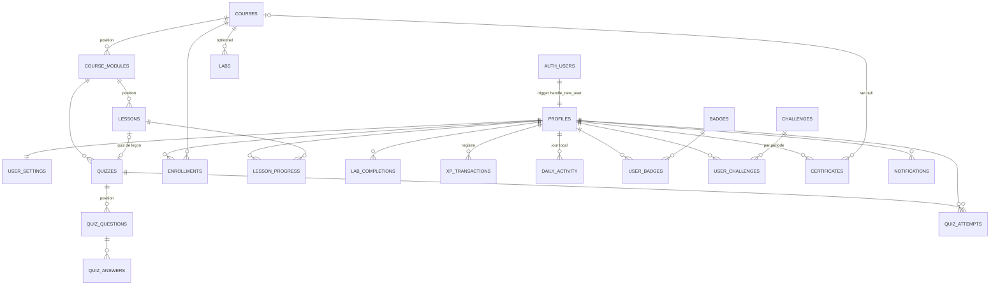

# Base de données

Le schéma complet est défini par les migrations de `supabase/migrations/`. Elles reconstruisent la base de zéro (`supabase db reset`) et sont la seule source de vérité : aucune table n'est créée à la main.

## Migrations

| Fichier | Contenu |
|---|---|
| `20260928190000_foundation.sql` | Schéma `private`, limites de débit, `profiles`, `user_settings`, rôles (`is_admin`, `is_superadmin`), `admin_logs`, activité et sessions, messages de contact, quota du mentor, RPC de compte |
| `20260928190100_learning_content.sql` | `courses`, `course_modules`, `lessons`, `quizzes`, `quiz_questions`, `quiz_answers`, `labs`, `private.lab_flags`, droits par colonne, contrôles de publication |
| `20260928190200_gamification.sql` | `levels`, `notifications`, `xp_transactions` (registre), `badges`, `user_badges`, `daily_activity`, `challenges`, `user_challenges`, `certificates` |
| `20260928190300_progress_engine.sql` | `enrollments`, `lesson_progress`, `quiz_attempts`, `lab_completions`, vue `course_progress`, moteur de progression et RPC apprenant |
| `20260928190400_admin.sql` | RPC d'administration, import de cours, statistiques, révocation de certificats, annonces, publication Realtime |
| `20260928190500_storage.sql` | Buckets et politiques Storage |

Les données de référence indispensables (20 niveaux, 10 badges, 4 défis) sont insérées par les migrations. Le contenu pédagogique de départ est dans `supabase/seed/01_starter_content.sql`.

## Relations



Toutes les tables liées à un utilisateur référencent `profiles(id)` avec `on delete cascade` : supprimer un compte supprime ses données. Les certificats gardent un instantané du titre du cours (`course_title`) et restent valides si le cours est supprimé (`on delete set null`).

## Tables principales

### Comptes

| Table | Points clés |
|---|---|
| `profiles` | Lié à `auth.users`. `email` (copie synchronisée par trigger depuis `auth.users`), `username` unique (`^[a-z0-9_]{3,32}$`), `display_name`, `avatar_path` (`<uid>/<fichier>`), `bio` (280 max), `role` (`user`, `admin`, `superadmin`), objectifs d'onboarding, `daily_minutes`. `xp`, `level`, `current_streak`, `longest_streak`, `last_activity_date` sont en lecture seule pour le client. Aucun mot de passe. |
| `user_settings` | `timezone` (validé contre `pg_timezone_names`, défaut `Europe/Paris`) et préférences de notifications. |
| `admin_logs` | Journal d'audit : auteur, action, cible, détails JSON. Alimenté par triggers et par les RPC/fonctions d'administration. |
| `activity_events`, `learner_sessions` | Fil d'activité et présence en ligne pour la console d'administration. |
| `contact_messages` | Messages du formulaire de contact (lecture réservée au staff). |

### Contenu

| Table | Points clés |
|---|---|
| `courses` | `slug` unique, `status` (`draft`, `published`, `archived`), `access_level` (`free`, `premium`, `private`), `level`, `category`, `estimated_duration`, `completion_xp` (100), `certificate_enabled`, `published_at`. La publication est refusée (`assert_course_publishable`) si le cours n'a aucun module, si un module n'a aucune leçon, si une leçon est vide ou si un quiz est incomplet. |
| `course_modules` | Ordonnés par `position`. |
| `lessons` | `course_id` déduit du module par trigger. `content_type` (`article`, `video`, `exercise`, `mixed`) et `content` JSONB `{ "blocks": [...] }` avec des blocs `text`, `heading`, `code`, `example`, `callout`, `schema`, `video`, `image`, `resource`, validés par trigger (80 blocs et 256 Ko maximum, URL en `https://`). `duration_minutes`, `xp_reward` (50). |
| `quizzes` | Rattachés à un module, et éventuellement à une leçon (un quiz maximum par leçon). `pass_percentage` (70). |
| `quiz_questions` | `single_choice`, `multiple_choice`, `true_false`, `explanation`, `difficulty`, `xp_reward` (10). |
| `quiz_answers` | La colonne `is_correct` n'est pas accessible aux apprenants. |
| `labs` et `private.lab_flags` | Exercices pratiques. Le drapeau attendu est stocké dans le schéma `private`, jamais exposé. |

### Progression et gamification

| Table | Points clés |
|---|---|
| `enrollments` | Unique par (utilisateur, cours). `status` `active` ou `completed`, dernière leçon ouverte. Prête pour les cours premium, privés ou par cohorte. |
| `lesson_progress` | Clé (utilisateur, leçon). `status` (`not_started`, `in_progress`, `completed`), `progress_percentage`, `started_at`, `completed_at`, `xp_awarded`. |
| `quiz_attempts` | Chaque tentative corrigée : score, pourcentage, réussite, XP attribuée. |
| `lab_completions` | Un lab résolu par utilisateur. |
| `course_progress` (vue) | Progression par cours calculée à la lecture (`security_invoker`, donc soumise au RLS). |
| `xp_transactions` | Registre d'XP : `amount`, `reason`, `reference_type`, `reference_id`, `label`. |
| `levels` | `level`, `required_xp`, `title`. |
| `daily_activity` | Compteurs par jour local : leçons, quiz, labs, XP, minutes d'étude. |
| `badges` / `user_badges` | Critères déclaratifs, attribution par le serveur. |
| `challenges` / `user_challenges` | Défis quotidiens, hebdomadaires ou uniques ; progression par période. |
| `certificates` | `certificate_number` (`CP-AAAA-000001`), `verification_code` (16 caractères), `recipient_name`, `course_title`, `revoked_at`, `pdf_path`. |
| `notifications` | Types `achievement`, `course`, `challenge`, `system`, `certificate`, `streak`, `level`. `link` doit être un chemin relatif. |

## XP et niveaux

`profiles.xp` n'est jamais modifié directement. Toute XP passe par `private.award_xp`, qui insère une ligne dans `xp_transactions`. Le trigger `apply_xp_ledger` met alors à jour `profiles.xp` et recalcule `profiles.level`, ce qui rend impossible toute incohérence entre XP et niveau.

- Motifs : `lesson_completed`, `quiz_completed`, `lab_completed`, `challenge_completed`, `course_completed`, `achievement`, `daily_goal`, `admin_adjustment`.
- L'index unique partiel `xp_transactions_once (user_id, reason, reference_id)` garantit qu'une leçon, un lab, un cours, un badge, un défi ou un objectif quotidien ne rapporte qu'une fois. Les quiz en sont exclus : une meilleure note rapporte seulement la différence avec la meilleure note précédente.
- Seul `admin_adjustment` accepte un montant négatif.
- Niveau `n` : `required_xp = 50 × n × (n - 1)`, soit 0, 100, 300, 600, 1000… jusqu'au niveau 20 (19 000 XP). Titres de « Recrue » à « Grand maître ». Un passage de niveau crée une notification.

## Série quotidienne

`private.record_activity` est appelée par chaque activité éligible (leçon terminée, quiz réussi, lab résolu). Le jour est calculé dans le fuseau de l'utilisateur (`user_settings.timezone`) :

- même jour que `last_activity_date` : rien ne change ;
- veille : `current_streak + 1` ;
- autre jour : la série repart à 1.

`longest_streak` garde le record. Des notifications sont créées à 3, 7, 14, 30, 50, 100, 200 et 365 jours. L'affichage utilise `private.effective_streak`, qui renvoie 0 si la dernière activité date d'avant-hier ou plus.

## Moteur de progression

| RPC | Effet |
|---|---|
| `enroll_in_course(course)` | Inscription. Automatique pour un cours publié gratuit ; un cours `premium` ou `private` exige une inscription existante (créée par un futur flux de paiement ou par un administrateur). |
| `start_lesson(lesson)` | Ouvre la leçon (et inscrit au cours si besoin), crée `lesson_progress` en `in_progress`, renvoie l'état et le temps minimal de 15 secondes. |
| `save_lesson_progress(lesson, pct)` | Sauvegarde le pourcentage de lecture. |
| `complete_lesson(lesson)` | Vérifie l'accès, l'ouverture préalable et le temps minimal, puis dans la même transaction : progression, XP, activité du jour, série, objectif quotidien, défis, badges, complétion du cours, certificat. Renvoie un résumé des récompenses. |
| `submit_quiz(quiz, answers)` | Correction serveur, tentative enregistrée, XP d'amélioration, puis la même chaîne de récompenses. Révèle les bonnes réponses et explications après correction. |
| `submit_lab(lab, answer)` | Compare au drapeau privé, avec budget de tentatives. |
| `get_my_dashboard()`, `get_my_stats()` | Agrégats calculés en SQL pour le tableau de bord et la page Progression. |
| `verify_certificate(code)` | Vérification publique d'un certificat (accessible à `anon`). |
| `mark_all_notifications_read()`, `reset_my_progress()`, `delete_my_account()` | Actions sur son propre compte. |

`private.course_mode` décide si l'appelant est `learner` (progression enregistrée) ou en `preview` (administrateur sur un contenu non publié, sans récompense). Un apprenant inscrit à un cours archivé garde l'accès et peut le terminer.

Fin de parcours : quand toutes les leçons sont terminées et tous les quiz réussis, `check_course_completion` passe l'inscription en `completed`, attribue `completion_xp`, notifie et, si `certificate_enabled`, appelle `issue_certificate`.

## Administration

`admin_overview`, `admin_users`, `admin_user_detail`, `admin_set_role` (superadmin, jamais sur soi-même), `admin_adjust_xp`, `admin_get_quiz`, `admin_save_quiz`, `admin_get_lab_flag`, `admin_set_lab_flag`, `admin_import_course` (crée toujours un brouillon), `admin_course_stats`, `admin_revoke_certificate`, `admin_restore_certificate`, `admin_broadcast_notification`. Chaque fonction commence par `private.require_admin()` ou `private.require_superadmin()`.

Les modifications de cours, modules, leçons, quiz, labs, badges et défis par le staff passent directement par PostgREST, protégées par des politiques `(select public.is_admin())`, et sont journalisées par triggers.

## Storage

| Bucket | Accès | Taille max | Types | Écriture |
|---|---|---|---|---|
| `avatars` | public | 2 Mo | PNG, JPEG, WebP | propriétaire, dans `<uid>/` |
| `course-images` | public | 5 Mo | images (SVG inclus) | staff |
| `lesson-assets` | public | 20 Mo | images, PDF, MP4 | staff |
| `certificates` | privé | 5 Mo | PDF | service role uniquement ; lecture par le propriétaire et le staff |

## Types TypeScript

`npm run db:types` exécute les migrations dans PGlite (PostgreSQL en WebAssembly, sans Docker) et régénère `types/database.types.ts`. Avec un projet lié, l'alternative officielle est :

```bash
npx supabase gen types typescript --linked --schema public > types/database.types.ts
```

`types/api.ts` décrit les formes JSON renvoyées par les RPC.

## Contenu de départ

`supabase/seed/content/*.ts` contient les parcours, leçons, quiz et labs rédigés. `npm run db:seed` les convertit en `supabase/seed/01_starter_content.sql`. Ce fichier ne crée aucun utilisateur ni aucune statistique ; il est chargé par `supabase db reset` en local, ou une fois dans l'éditeur SQL en production.

## Tests

`npm test` lance deux fichiers avec le runner natif de Node.

`tests/database.test.cjs` (20 tests) applique les migrations et le contenu de départ dans PGlite, avec une émulation minimale des rôles Supabase (`anon`, `authenticated`, `auth.uid()`). Il couvre notamment :

- création du profil à l'inscription, RLS sur toutes les tables, isolation entre deux apprenants ;
- droits par colonne (bonnes réponses cachées, contenu des leçons invisible pour `anon`) ;
- impossibilité de forger XP, rôle ou certificat depuis le navigateur ;
- temps minimal d'une leçon, XP unique, quiz corrigés côté serveur sans farming, budget des labs ;
- cohérence XP, niveaux, défis quotidiens et notifications ; série selon le fuseau horaire ;
- certificat en fin de parcours, révocation et restauration ;
- brouillons privés et publication incomplète refusée, rôles appliqués par la base, ajustements d'XP audités ;
- isolation des dossiers Storage, limite de débit du formulaire de contact, réinitialisation de la progression.

`tests/learning.test.cjs` (11 tests) couvre la logique TypeScript partagée : calcul de niveau, série, redirections sûres, traduction des erreurs, validation des imports de cours et des quiz, rendu des blocs de leçon.
